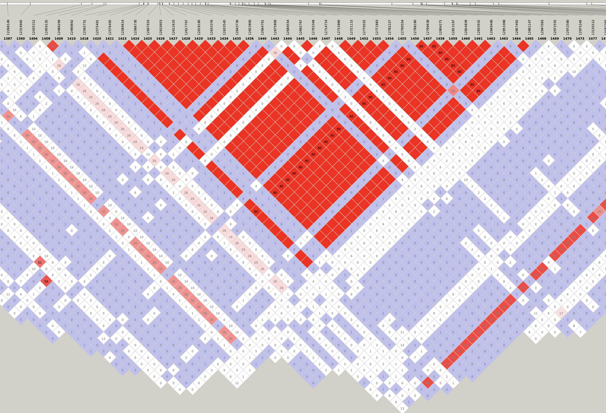

# Setup

## Create conda evironment


```bash
conda env create \
  -n mikk_env \
  -f mikk_genome/code/config/conda_env.yml
  
conda activate mikk_env
```

## Load R packages


```r
require(here)
require(tidyverse)
```

## Create directory structure and clone repo

(Working directory on EBI cluster: `/hps/research1/birney/users/ian/mikk_paper`)


```bash
# move to working directory
cd /your/working/directory
# clone git repository
git clone https://github.com/Ian-Brettell/mikk_genome.git
# create directory for VCFs
mkdir vcfs
```

## Copy MIKK panel VCF into working directory

(See supplementary material for how VCF was generated.)


```bash
cp /nfs/research1/birney/projects/medaka/inbred_panel/medaka-alignments-release-94/vcf/medaka_inbred_panel_ensembl_new_reference_release_94.vcf* vcfs
```

## Key-value file for cram ID to line ID

`mikk_genome/data/20200206_cram_id_to_line_id.txt`

## Remove sibling lines and replicates

**Full list of 80 extant MIKK panel lines**: `mikk_genome/data/20200210_panel_lines_full.txt`

**Note**: Line `130-2` is missing from the MIKK panel VCF.

Identify sibling lines


```bash
cat mikk_genome/data/20200210_panel_lines_full.txt | cut -f1 -d"-" | sort | uniq -d
```

- 106
- 11
- 117
- 131
- 132
- 135
- 14
- 140
- 23
- 39
- 4
- 40
- 59
- 69
- 72
- 80

Only keep first sibling line ( suffix _1); manually remove all others and write list of non-sibling lines to here: `mikk_genome/data/20200227_panel_lines_no-sibs.txt`. 64 lines total.

Excluded sibling lines here: `mikk_genome/data/20200227_panel_lines_excluded.txt`. 16 lines total.

Replace all dashes with underscores to match `mikk_genome/data/20200206_cram_id_to_line_id.txt` key file

```bash
sed 's/-/_/g' mikk_genome/data/20200227_panel_lines_no-sibs.txt \
  > mikk_genome/data/20200227_panel_lines_no-sibs_us.txt
```

Extract the lines to keep from the key file.

```bash
awk  'FNR==NR {f1[$0]; next} $2 in f1' \
  mikk_genome/data/20200227_panel_lines_no-sibs_us.txt \
  mikk_genome/data/20200206_cram_id_to_line_id.txt \
    > mikk_genome/data/20200227_cram2line_no-sibs.txt
```

Has 66 lines instead of 63 (64 lines minus `130-2`, which isn't in the VCF), so there must be replicates Find out which ones:


```bash
cat mikk_genome/data/20200227_cram2line_no-sibs.txt | cut -f2 | cut -f1 -d"_" | sort | uniq -d
```

32
71
84

Manually removed duplicate lines (`mikk_genome/data/20200227_duplicates_excluded.txt`):

* 24271_7#5	32_2
* 24271_8#4	71_1
* 24259_1#1	84_2

Final no-sibling-lines CRAM-to-lineID key file: `mikk_genome/data/20200227_cram2line_no-sibs.txt`

# Create no-sibling-lines MIKK panel VCF


```bash
# create no-sibs file with CRAM ID only
cut -f1 mikk_genome/data/20200227_cram2line_no-sibs.txt \
  > mikk_genome/data/20200227_cram2line_no-sibs_cram-only.txt
  
# make new VCF having filtered out non-MIKK and sibling lines
bcftools view \
  --output-file vcfs/panel_no-sibs.vcf \
  --samples-file mikk_genome/data/20200227_cram2line_no-sibs_cram-only.txt \
  vcfs/medaka_inbred_panel_ensembl_new_reference_release_94.vcf
  
# recode with line IDs
bcftools reheader \
  --output vcfs/panel_no-sibs_line-ids.vcf \
  --samples mikk_genome/data/20200227_cram2line_no-sibs.txt \
  vcfs/panel_no-sibs.vcf
  
# compress
bcftools view \
  --output-type z \
  --output-file vcfs/panel_no-sibs_line-ids.vcf.gz \
  vcfs/panel_no-sibs_line-ids.vcf
  
# index
bcftools index \
  --tbi \
  vcfs/panel_no-sibs_line-ids.vcf.gz

# get stats
mkdir stats

bcftools stats \
  vcfs/panel_no-sibs_line-ids.vcf.gz \
  > stats/20200305_panel_no-sibs.txt

## get basic counts
grep "^SN" stats/20200305_panel_no-sibs.txt
```

## Make a version with no missing variants


```bash
vcftools \
  --gzvcf vcfs/panel_no-sibs_line-ids.vcf.gz \
  --max-missing 1 \
  --recode \
  --stdout > vcfs/panel_no-sibs_line-ids_no-missing.vcf
  
# compress
bcftools view \
  --output-type z \
  --output-file vcfs/panel_no-sibs_line-ids_no-missing.vcf.gz \
  vcfs/panel_no-sibs_line-ids_no-missing.vcf

# create index
bcftools index \
  --tbi vcfs/panel_no-sibs_line-ids_no-missing.vcf.gz
  
# get stats 
bcftools stats \
  vcfs/panel_no-sibs_line-ids_no-missing.vcf.gz \
  > stats/20200305_panel_no-sibs_no-missing.txt

# get basic counts
grep "^SN" stats/20200305_panel_no-sibs_no-missing.txt
```

# Generate Haploview plots

## Create `plink` dataset from no-sib-lines, no-missing VCF


```bash
mkdir plink/20200716_panel_no-sibs_line-ids_no-missing

# make BED  
plink \
  --vcf vcfs/panel_no-sibs_line-ids_no-missing.vcf.gz \
  --make-bed \
  --double-id \
  --snps-only \
  --biallelic-only \
  --chr-set 24 no-xy \
  --chr 1-24 \
  --out plink/20200716_panel_no-sibs_line-ids_no-missing/20200716
  
# recode for 012 transposed
plink \
  --bfile plink/20200716_panel_no-sibs_line-ids_no-missing/20200716 \
  --recode A-transpose \
  --out plink/20200716_panel_no-sibs_line-ids_no-missing/20200716_recode012
```

## Create BED sets filtered for MAF > 0.03, 0.05 and 0.10


```bash
maf_thresholds=$( echo 0.03 0.05 0.10 )

# Make new BEDs 
for i in $maf_thresholds ; do
  # make directory
  new_path=plink/20200716_panel_no-sibs_line-ids_no-missing/20200803_maf-$i ;
  # make directory
  if [ ! -d "$new_path" ]; then
    mkdir $new_path;
  fi
  # make BED set
  plink \
    --bfile plink/20200716_panel_no-sibs_line-ids_no-missing/20200716 \
    --make-bed \
    --double-id \
    --chr-set 24 no-xy \
    --maf $i \
    --out $new_path/20200803
done
```

## Recode for Haploview


```bash
# Create output directory
mkdir plink/20200716_panel_no-sibs_line-ids_no-missing/20200803_hv_thinned

hv_thinned_path=plink/20200716_panel_no-sibs_line-ids_no-missing/20200803_hv_thinned

# Recode
for i in $maf_thresholds ; do
  new_path=$hv_thinned_path/$i ;
  # make directory
  if [ ! -d "$new_path" ]; then
    mkdir $new_path;
  fi 
  # recode 
  for j in $(seq 1 24); do
    plink \
      --bfile plink/20200716_panel_no-sibs_line-ids_no-missing/20200803_maf-$i/20200803 \
      --recode HV-1chr \
      --double-id \
      --chr-set 24 no-xy \
      --chr $j \
      --allele1234 \
      --thin-count 3000 \
      --out $hv_thinned_path/$i/20200803_chr-$j;
  done;
done

# Edit .ped files to remove asterisks
for i in $maf_thresholds ; do
  for j in $(find $hv_thinned_path/$i/20200803_chr-*.ped); do
    sed -i 's/\*/0/g' $j;
  done;
done  

# Edit .info files to make the SNP's bp position its ID
for i in $maf_thresholds; do
  for j in $(find $hv_thinned_path/$i/20200803_chr*.info); do
    outname=$(echo $j\_with-id);
    awk -v OFS="\t" {'print $2,$2'} $j > $outname;
  done;
done
```

## Plot

**NOTE**: This code requires `Haploview`, which you will need to install on your system: <https://www.broadinstitute.org/haploview/haploview>


```bash
hv_path=/nfs/software/birney/Haploview.jar # edit to your Haploview path

mkdir plots/20200803_ld_thinned/

for i in $maf_thresholds; do
  # set output directory
  new_path=plots/20200803_ld_thinned/$i ;
  # make directory
  if [ ! -d "$new_path" ]; then
    mkdir $new_path;
  fi   
  for j in $(seq 1 24); do
    bsub -M 20000 -o log/20200803_hv_$i\_$j.out -e log/20200803_hv_$i\_$j.err \
    "java -Xms18G -Xmx18G -jar $hv_path \
      -memory 18000 \
      -pedfile $hv_thinned_path/$i/20200803_chr-$j.ped  \
      -info $hv_thinned_path/$i/20200803_chr-$j.info_with-id \
      -maxDistance 1000 \
      -ldcolorscheme DEFAULT \
      -ldvalues RSQ \
      -minMAF $i \
      -nogui \
      -svg \
      -out $new_path/$j";
  done;
done
```

These `svg` files can be converted to `pdf` using:
* <https://www.zamzar.com/> for files > 30 MB (chr 1) - note limit on number of files you can convert
* <https://onlineconvertfree.com/convert-format/svg-to-pdf/> for the rest

The full Haploview LD plots are available in the Supplementary Material.

By inspecting these LD plots at the `MAF > 0.05` level, we discovered the following LD blocks worthy of further investigation:

* 5:28181970-28970558 (788 Kb)
* 6:29398579-32246747 (2.85 Mb)
* 12:25336174-25384053 (48 Kb)
* 14:12490842-12947083 (456 Kb)
* 17:15557892-19561518 (4 Mb)
* 21:6710074-7880374 (1.17 Mb)

See zoomed plots here:


 




