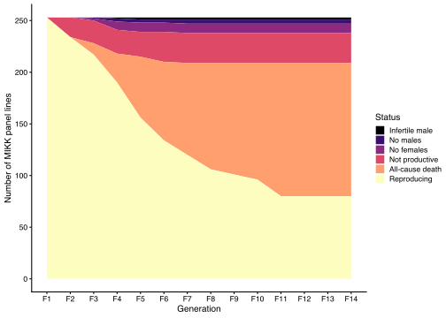
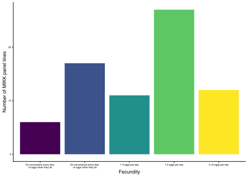
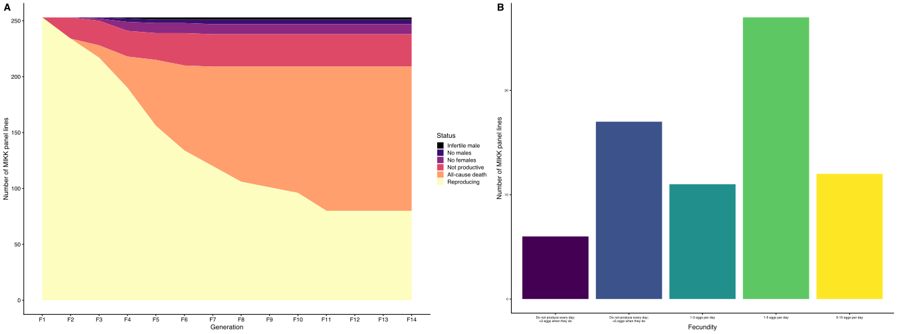

# Setup


```r
library(here)
source(here::here("code", "scripts", "fecundity", "source.R"))
```

# Inbreeding

Data saved here (copied from Felix's table in the paper):
`data/fecundity/20210212_inbreeding.csv`

## Read in data


```r
raw_dat = here::here("data", "fecundity", "20210212_inbreeding.csv")
inbreed_df = readr::read_csv(raw_dat)
```

```
## 
## ── Column specification ────────────────────────────────────────────────────────────────────────
## cols(
##   MIKK = col_character(),
##   `Inbreeding (Generation)` = col_character(),
##   `not productive` = col_double(),
##   `infertile male` = col_double(),
##   `no males` = col_double(),
##   `no females` = col_double(),
##   `all cause death` = col_double(),
##   `N of strains lost` = col_character()
## )
```

```r
total_crosses = 253

inbreed_df_tidy = inbreed_df %>%
  # Remove final row, which makes `N of strains lost` character
  dplyr::slice(-c(11,12)) %>% 
  # Change column names
  dplyr::select(GENERATION = `Inbreeding (Generation)`,
                N_LOST_TOTAL = `N of strains lost`,
                everything()) %>% 
  # Make N_LOST integer
  dplyr::mutate(N_LOST_TOTAL = as.integer(N_LOST_TOTAL)) %>% 
  # Remove MIKK column
  dplyr::select(-MIKK) %>% 
  # Get cumulative lost and N_SURVIVING
  dplyr::mutate(N_LOST_CUM = cumsum(N_LOST_TOTAL),
                N_SURVIVING = total_crosses - N_LOST_CUM) %>% 
  # Replace 
  dplyr::mutate(dplyr::across(c(`not productive`,
                                `infertile male`,
                                `no males`,
                                `no females`,
                                `all cause death`),
                              ~tidyr::replace_na(.x, 0))) %>% 
  # Get cumulative lost for each category
  dplyr::mutate(dplyr::across(c(`not productive`,
                                `infertile male`,
                                `no males`,
                                `no females`,
                                `all cause death`),
                              ~cumsum(.x))) %>% 
  # Amend GENERATION column
  dplyr::mutate(GENERATION = stringr::str_extract(GENERATION, "(?:F\\d{1,2})")) %>% 
  # Add first row
  rbind(., c("F1", rep(0,7), total_crosses)) %>% 
  # Add rows for F12-14
  rbind(., dplyr::filter(., GENERATION == "F11") %>%
            dplyr::slice(rep(1:n(), each = 3)) %>%
            dplyr::mutate(GENERATION = c("F12", "F13", "F14"))) %>% 
  # Factorise GENERATION
  dplyr::mutate(GENERATION = factor(GENERATION, levels = paste("F", seq(1:14), sep = ""))) %>% 
  # Order
  .[order(.$GENERATION), ] %>% 
  # Gather 
  tidyr::pivot_longer(cols = c(`not productive`,
                               `infertile male`,
                               `no males`, 
                               `no females`,
                               `all cause death`,
                               N_SURVIVING),
                      names_to = "STATUS",
                      values_to = "N") %>% 
  # Convert `N` to integer
  dplyr::mutate(N = as.integer(N))

knitr::kable(head(inbreed_df_tidy))
```


|GENERATION |N_LOST_TOTAL |N_LOST_CUM |STATUS          |   N|
|:----------|:------------|:----------|:---------------|---:|
|F1         |0            |0          |not productive  |   0|
|F1         |0            |0          |infertile male  |   0|
|F1         |0            |0          |no males        |   0|
|F1         |0            |0          |no females      |   0|
|F1         |0            |0          |all cause death |   0|
|F1         |0            |0          |N_SURVIVING     | 253|

## Plot


```r
recode_vec = c("Infertile male",
               "No males",
               "No females", 
               "Not productive",
               "All-cause death", 
               "Reproducing")
names(recode_vec) = c("infertile male", 
                      "no males", 
                      "no females", 
                      "not productive", 
                      "all cause death", 
                      "N_SURVIVING")

test = inbreed_df_tidy %>% 
  # geom_area() seems to need `x` to be numeric
  dplyr::mutate(GENERATION = as.integer(gsub("F", "", GENERATION))) %>%
  # recode STATUS values and order
  dplyr::mutate(STATUS = dplyr::recode(STATUS, !!!recode_vec),
                STATUS = factor(STATUS, levels = recode_vec))# %>% 
out2 = ggplot(test) +
    geom_area(aes(x=GENERATION,
                  y=N,
                  fill = STATUS)) +
#    geom_text(aes(x=GENERATION, y=N, label = STATUS)) +
    scale_fill_viridis_d(option = "magma") +
    scale_x_continuous(breaks = unique(test$GENERATION),
                       labels = paste("F", unique(test$GENERATION), sep = "")) +
    theme_cowplot(font_size = 10) +
    xlab("Generation") +
    ylab("Number of MIKK panel lines") +
    labs(fill = "Status") +
    theme(panel.grid = element_blank())
#    theme(legend.position=c(0.2, 0.3),
#          legend.box.background = element_blank())

out2
```

<!-- -->

# Fecundity

## Read in data


```r
in_file = here::here("data", "fecundity", "20210205_semiquantitative.xlsx")
df_semi = readxl::read_xlsx(in_file, range = "A1:C81")
out_file = here::here("data", "fecundity", "20210208_semiquant.csv")

# Get strain levels
strain_levels = unique(df_semi$Pair)

# Create recode vector
date_recode = c("Feb 2019", "Jul 2020")
names(date_recode) = c("2/19", "7/20")
recode_vec_1 = c(0, 1, 2, 3, 4, 5)
names(recode_vec_1) = c(0, "o", "x", "x/", "xx", "xxx")
recode_vec_2 = c("Not producing",
                 "Do not produce every day; <3 eggs when they do",
                 "Do not produce every day; <5 eggs when they do",
                 "1-3 eggs per day",
                 "1-5 eggs per day",
                 "5-10 eggs per day")
names(recode_vec_2) = c(0, 1, 2, 3, 4, 5)
recode_vec_3 = gsub("; ", ";\n", recode_vec_2)

# Tidy

semi_out = df_semi %>% 
  # pivot fecundity
  tidyr::pivot_longer(cols = contains("fecundity"), 
                      names_to = "DATE",
                      names_prefix = "fecundity ",
                      values_to = "FECUNDITY") %>% 
  # recode fecundity measures
  dplyr::mutate(DATE = dplyr::recode(DATE, !!!date_recode),
                FECUNDITY = dplyr::recode(FECUNDITY, "xx/" = "xx"),
                FECUNDITY = dplyr::na_if(FECUNDITY, "do not prod. Yet"),
                FECUNDITY = ifelse(is.na(FECUNDITY), 0, FECUNDITY),
                FECUNDITY = dplyr::recode(FECUNDITY, !!!factor(recode_vec_1)),
                KEY = dplyr::recode(FECUNDITY, !!!recode_vec_2)) %>%
  # rename STRAIN
  dplyr::rename(STRAIN = Pair) %>% 
  # factorise
  dplyr::mutate(STRAIN = factor(STRAIN, levels = strain_levels)) %>% 
  # write to file
  readr::write_csv(out_file, na = "")

knitr::kable(head(semi_out))
```


|STRAIN |DATE     |FECUNDITY |KEY                                            |
|:------|:--------|:---------|:----------------------------------------------|
|4-1    |Jul 2020 |2         |Do not produce every day; <5 eggs when they do |
|4-1    |Feb 2019 |2         |Do not produce every day; <5 eggs when they do |
|4-2    |Jul 2020 |2         |Do not produce every day; <5 eggs when they do |
|4-2    |Feb 2019 |4         |1-5 eggs per day                               |
|5-1    |Jul 2020 |2         |Do not produce every day; <5 eggs when they do |
|5-1    |Feb 2019 |4         |1-5 eggs per day                               |

## Plot


```r
# Process data
final_hor_df = semi_out %>% 
  dplyr::mutate(KEY = gsub("; ", ";\n", KEY),
                KEY = factor(KEY, levels = recode_vec_3)) %>% 
  dplyr::filter(DATE == "Jul 2020") %>% 
  dplyr::mutate(STRAIN = factor(STRAIN, levels=unique(STRAIN[order(KEY,decreasing = T)]))) %>% 
  # remove "Not producing"
  dplyr::filter(KEY != "Not producing")
  # order by category

# Generate histogram
fec_count = final_hor_df %>% 
  ggplot() +
    geom_histogram(aes(KEY, fill = KEY),
                   stat = "count") +
    scale_fill_viridis_d() +
    theme_cowplot(font_size = 10) +
    xlab("Fecundity") +
    ylab("Number of MIKK panel lines") +
    guides(fill = F) +
    theme(axis.text = element_text(size = 5))

fec_count
```

<!-- -->

# Final figure


```r
final = ggdraw() +
  draw_plot(out2, x = 0, y = 0, width = .55, height = 1) +
  draw_plot(fec_count, x = .55, y = 0, width = .45, height = 1) +
  draw_plot_label(label = c("A", "B"), size = 15,
                  x = c(0, 0.55), y = c(1, 1))

final
```

<!-- -->


```r
# SVG
ggsave(here("plots", "fecundity", "20210301_final_figure.svg"),
       device = "svg",
       units = "cm",
       height = 11.2,
       width = 30)

# PNG
ggsave(here("plots", "fecundity", "20210301_final_figure.png"),
       device = "png",
       dpi = 400,
       units = "cm",
       height = 11.2,
       width = 30)
```
